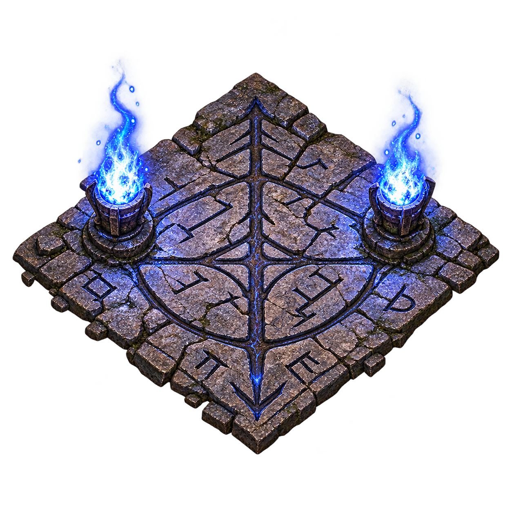

# D2R Ultimate Seed Finder

<p align="center">
  
</p>

**D2R Ultimate Seed Finder** is a standalone Windows utility for finding and ranking convenient **Diablo II: Resurrected offline Hell map seeds** across several popular farming routes.

It scans random seeds, evaluates eleven farming targets, keeps a persistent local database of tested seeds, and builds a leaderboard so you can look for one map seed that is strong across the routes you care about.

> **Portable:** download one `.exe` and run it.  
> No Node.js, npm, BAT files, or installation are required.

## Features

- Standalone **Windows x64 portable EXE**
- Random offline Hell seed scanning
- Persistent local seed database
- Already-tested GUI seed IDs are skipped on future scans
- Safe stop: completed results are kept
- Top-seed leaderboard
- Per-route **Route Rating / 10**
- Overall **Dream Rating / 10**
- Tie-aware deterministic ranking
- Balanced, Boss Farming, Rune Farming, and Custom weight presets
- Legacy import support for the earlier v0.6 `all_valid_seeds.csv`
- Analyze your own seed IDs, including seeds that miss strict search rules
- Startup sanity/regression checks for important map detectors

## Farming targets

The current scanner evaluates these eleven targets:

| Act | Target | Route represented |
|---|---|---|
| I | Andariel | Catacombs Level 2 waypoint toward deeper Catacombs / Andariel |
| I | Forgotten Tower / Countess | Black Marsh waypoint to Forgotten Tower entrance |
| I | The Pit | Best approach from Black Marsh or Outer Cloister |
| I | Tristram | Stony Field waypoint to the Cairn Stones |
| II | Duriel / True Tomb | Canyon waypoint to the true Tomb, then Tomb entry to the Orifice |
| III | Mephisto | Durance of Hate Level 2 waypoint to Durance Level 3 |
| III | Lower Kurast | Exactly two campfires / six superchests, both screen-right of the waypoint |
| IV | River of Flame Superchests | River of Flame waypoint through the shortest detected 3- or 4-superchest route |
| V | Thresh Socket | Arreat Plateau waypoint toward Crystalline Passage |
| V | Nihlathak | Halls of Pain waypoint to the Halls of Vaught entrance |
| V | Worldstone / Baal | WSK Level 2 waypoint to WSK3, then toward Throne of Destruction |

## Download

For normal use, download the latest:

`D2R-Ultimate-Seed-Finder-<version>-Portable.exe`

from the GitHub Releases page or Nexus Mods.

You do **not** need to download the source code.

## Installation

There is no installer.

1. Download the Portable EXE.
2. Put it anywhere you like.
3. Double-click it.
4. Start scanning.

The app stores its persistent database and settings in the normal Windows per-user application-data location. Replacing the EXE with a newer version does not intentionally erase your scan history.

## How to use

1. Launch the app.
2. Choose how many new seeds you want to scan.
3. Pick a ranking preset:
   - **Balanced** — equal route weights.
   - **Boss Farming** — emphasizes Andariel, Duriel, Mephisto, Nihlathak, and Baal.
   - **Rune Farming** — emphasizes Countess, Lower Kurast, and River of Flame.
   - **Custom** — adjust the individual route sliders yourself.
4. Click **Start Scan**.
5. Click any seed in the leaderboard to inspect its route ratings and technical details.
6. To test seeds you already know, paste them into **Analyze Your Own Seeds**. Strict matches can join the candidate database; other seeds remain rankable with penalties for failed routes.
7. Use **Copy Seed** to copy a selected seed.

A first test of a few hundred or a few thousand seeds is a good way to get familiar with the interface. Larger scans build a stronger comparison database.

## Understanding the scores

### Balance Score ↓

This is the scanner's underlying overall ranking value. **Lower is better.**

For each valid seed, every route is converted to a percentile relative to the valid candidates currently stored in the database. Equal raw route values receive the same tie-aware percentile.

The overall score combines:

- **75%** weighted mean of the route percentiles
- **25%** the seed's weakest route percentile

This prevents one exceptionally good route from completely hiding a terrible route elsewhere.

Your route-weight sliders affect the weighted-mean portion of the calculation.

### Route Rating / 10

The GUI turns a route percentile into a friendlier higher-is-better display:

`Route Rating = 10 × (1 - route percentile)`

So, approximately:

- top 5% → 9.5 / 10
- top 20% → 8.0 / 10
- median → 5.0 / 10

**ELITE** means the route is in roughly the top 10% of currently stored valid candidates.

### Dream Rating / 10

Dream Rating is a friendly display based on a seed's **database rank**:

- #1 → 10.0
- #10 → 9.5
- #100 → 9.0
- #1000 → 8.5

It is deliberately a relative display score. It is **not** an absolute claim that one seed is objectively "10/10" in-game.

## Important scoring limitation

The scanner is a **map-layout convenience finder**, not an in-game movement simulator.

Several routes use deterministic geometry/distance proxies derived from the generated map layout. They are useful for comparing large numbers of seeds consistently, but they are not literal measured teleport times, collision-perfect walking distances, or guarantees about how a route will feel to every character/build.

For promising seeds, final in-game testing is recommended.

## Lower Kurast filter

A valid Lower Kurast candidate must have:

- exactly **two campfires**
- therefore six associated superchests
- both camps on the **screen-right side of the waypoint**

The LK score combines:

`Waypoint → Camp 1 + Camp 1 → Camp 2`

This is intentionally strict because the project was built around convenient repeatable LK farming layouts.


## River of Flame superchest filter

A current scanner candidate must expose at least **three deterministic chest presets** in River of Flame. This is a hard eligibility rule: one or two detected chests are not enough. The scanner starts at the River of Flame waypoint, chooses four chests when four are present (otherwise three), and searches for the shortest open route through those chest locations. The three/four chests do not have to meet a separate fixed distance cutoff; closeness is reflected by the route score, so nearer layouts rank better.

The River metric uses the route distance normalized by the number of opened chests, so a four-chest layout is not automatically penalized simply because it contains an extra stop. The technical-details panel also shows the detected chest count and the total route distance.

Because three-chest River of Flame layouts are rare, startup preflight uses several community-documented three-chest seeds rather than hoping to find one in a small random validation sample.

## Analyze your own seeds

The **Analyze Your Own Seeds** box accepts one or more seed IDs separated by spaces, commas, semicolons, or new lines. Up to 100 can be evaluated at once.

Seeds that satisfy all current scanner filters are stored in the same persistent candidate database as scanner discoveries and receive an actual database rank and Dream Rating under the current weights. A manually entered seed that misses a strict rule is still evaluated and ranked for comparison: failed or unavailable routes receive a worst-route penalty. These penalty-ranked personal seeds do **not** join the strict candidate leaderboard or affect scanner yield statistics.

Older nine-route candidates remain readable after upgrading. Their two new route values are shown as **Not Scored** until that seed is re-analyzed with the current engine.

## Database and privacy

The program works locally.

It does not require a Diablo II account login and does not edit your character save files.

The seed database contains scanner results and settings used by the application.

## Legacy v0.6 import

If you used the earlier command-line v0.6 scanner, the GUI can import its `all_valid_seeds.csv`.

When the original `run_summary.txt` or `best_overall_seeds.txt` is available next to that CSV, the GUI can also restore the represented total number of evaluated seeds from that legacy run.

Old rejected seed IDs were not saved by v0.6, so those specific rejected IDs cannot be retroactively reconstructed.

## Windows SmartScreen

Public builds may initially show a Windows SmartScreen / **Unknown publisher** warning because the executable is not currently Authenticode-signed.

Always download releases from the official GitHub repository or the official Nexus Mods page and compare SHA-256 hashes if you want to verify the exact file.

## SHA256SUMS.txt

GitHub releases include a `SHA256SUMS.txt` file.

It is simply a cryptographic fingerprint of the release EXE. Normal users do not need it, but it lets you verify that a downloaded executable matches the official build.

PowerShell example:

```powershell
Get-FileHash ".\D2R-Ultimate-Seed-Finder-1.5.2-Portable.exe" -Algorithm SHA256
```

Compare the printed hash with the value in `SHA256SUMS.txt`.

## Building from source

End users do **not** need Node.js.

Developers building the project from source do.

See [DEVELOPMENT.md](DEVELOPMENT.md).

## Credits

This project uses:

- [libd2](https://github.com/jaenster/libd2) by jaenster for deterministic Diablo II map generation / DRLG data.
- [Electron](https://www.electronjs.org/) for the desktop application runtime.
- [electron-builder](https://www.electron.build/) for Windows packaging.

The libd2 maintainer granted this project permission to redistribute the bundled libd2 npm/WASM package in the free community application.

See [THIRD_PARTY_NOTICES.txt](THIRD_PARTY_NOTICES.txt) for additional information.

## Author

**ArcBee**

## Support the project

If D2R Ultimate Seed Finder has been useful to you and you'd like to support continued development, you can buy me a coffee via PayPal:

[Support D2R Ultimate Seed Finder on PayPal](https://paypal.me/arcbeematt?locale.x=en_US&country.x=ZA)

Support is completely optional. The project will remain free and open source.

## License

The original source code for D2R Ultimate Seed Finder is released under the [MIT License](LICENSE).

Third-party libraries, game-related material, trademarks, and branding/assets are subject to their respective licenses and rights and are not relicensed by the project's MIT license.

## Disclaimer

D2R Ultimate Seed Finder is an independent community project and is not affiliated with, endorsed by, or sponsored by Blizzard Entertainment.

Diablo II and Diablo II: Resurrected are trademarks of Blizzard Entertainment.
